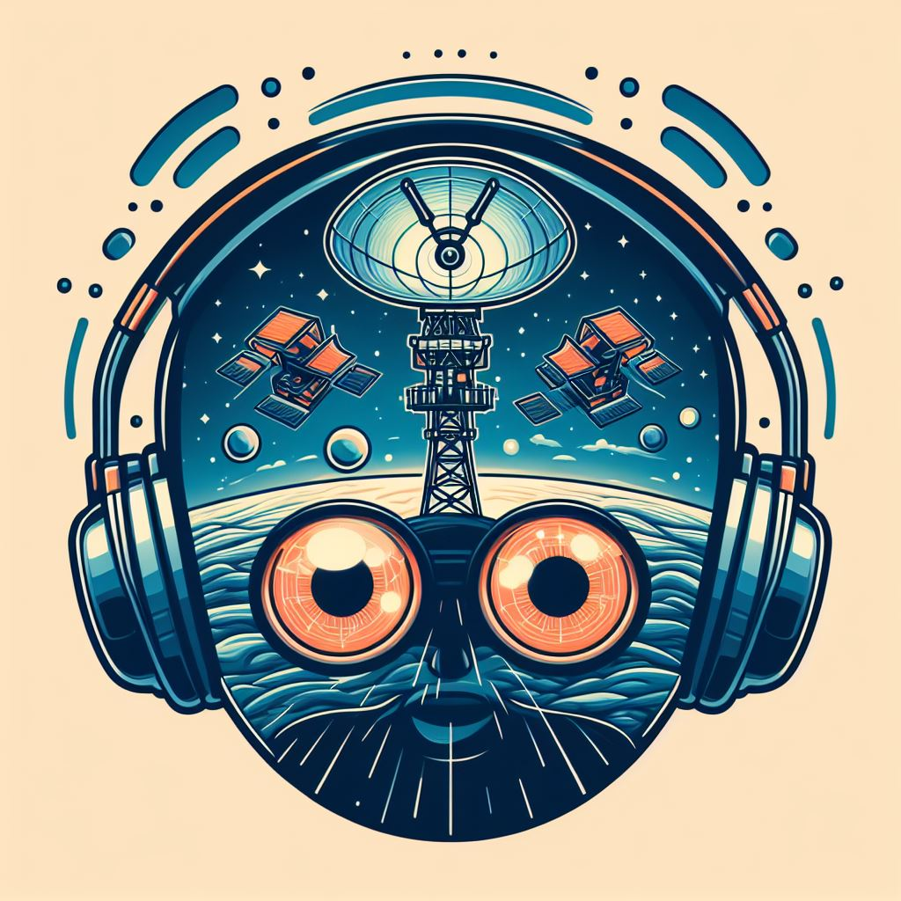

<p align="center">
  
</p>

# solo-learn-radio
A fork of awesome solo-learn library from v.1.0.7. A library of self-supervised methods for unsupervised visual representation learning powered by PyTorch Lightning.
**solo-learn [paper](#citation)**.

This work add compatibility to radio astronomical datasets and functions to benchmark available methods on those use cases.

---

## News
* Updated to include all4one method
* Added fixed fold k-fold cross validation training script
* Added k-fold cross validation
* Added benchmark experiment generator
* Added online balancing strategy
* Added specific augmentations for radio images
* Added specific data classes for radio images

---

## Quickstart
* Clone the repo
* Download train dataset
* Train a model (or download one)
* Download test dataset
* Eval the model
* Plot latent space with classification

---

## Training methods available
* [Barlow Twins](https://arxiv.org/abs/2103.03230)
* [BYOL](https://arxiv.org/abs/2006.07733)
* [DeepCluster V2](https://arxiv.org/abs/2006.09882)
* [DINO](https://arxiv.org/abs/2104.14294)
* [MAE](https://arxiv.org/abs/2111.06377)
* [MoCo V2+](https://arxiv.org/abs/2003.04297)
* [MoCo V3](https://arxiv.org/abs/2104.02057)
* [NNBYOL](https://arxiv.org/abs/2104.14548)
* [NNCLR](https://arxiv.org/abs/2104.14548)
* [NNSiam](https://arxiv.org/abs/2104.14548)
* [ReSSL](https://arxiv.org/abs/2107.09282)
* [SimCLR](https://arxiv.org/abs/2002.05709)
* [SimSiam](https://arxiv.org/abs/2011.10566)
* [Supervised Contrastive Learning](https://arxiv.org/abs/2004.11362)
* [SwAV](https://arxiv.org/abs/2006.09882)
* [VIbCReg](https://arxiv.org/abs/2109.00783)
* [VICReg](https://arxiv.org/abs/2105.04906)
* [W-MSE](https://arxiv.org/abs/2007.06346)

---

## Extra flavor

### Backbones
* [ResNet](https://arxiv.org/abs/1512.03385)
* [WideResNet](https://arxiv.org/abs/1605.07146)
* [ViT](https://arxiv.org/abs/2010.11929)
* [Swin](https://arxiv.org/abs/2103.14030)
* [PoolFormer](https://arxiv.org/abs/2111.11418)
* [ConvNeXt](https://arxiv.org/abs/2201.03545)

### Evaluation
* Offline k-fold cross validation
* Standard offline linear evaluation.
* Offline K-NN evaluation.
* Feature space visualization with UMAP.

### Logging
* Metric logging on the cloud with [WandB](https://wandb.ai/site)
* Custom model checkpointing with a simple file organization.

---
## Requirements
* torch
* torchvision
* tqdm
* einops
* wandb
* pytorch-lightning
* lightning-bolts
* torchmetrics
* scipy
* timm

**Optional**:
* nvidia-dali
* matplotlib
* seaborn
* pandas
* umap-learn

---

## Installation

First clone the repo.

Then, to install solo-learn with [Dali](https://github.com/NVIDIA/DALI) and/or UMAP support, use:
```
pip3 install .[dali,umap,h5] --extra-index-url https://developer.download.nvidia.com/compute/redist
```

If no Dali/UMAP/H5 support is needed, the repository can be installed as:
```
pip3 install .
```

For local development:
```
pip3 install -e .[umap,h5]
# Make sure you have pre-commit hooks installed
pre-commit install
```

**NOTE:** if you are having trouble with dali, install it following their [guide](https://github.com/NVIDIA/DALI).

**NOTE 2:** consider installing [Pillow-SIMD](https://github.com/uploadcare/pillow-simd) for better loading times when not using Dali.

**NOTE 3:** Soon to be on pip.

---

## Training

For pretraining the backbone, follow one of the many bash files in `scripts/pretrain/`.
We are now using [Hydra](https://github.com/facebookresearch/hydra) to handle the config files, so the common syntax is something like:
```bash
python3 main_pretrain.py \
    # path to training script folder
    --config-path scripts/pretrain/imagenet-100/ \
    # training config name
    --config-name barlow.yaml
    # add new arguments (e.g. those not defined in the yaml files)
    # by doing ++new_argument=VALUE
    # pytorch lightning's arguments can be added here as well.
```

After that, for offline linear evaluation, follow the examples in `scripts/linear` or `scripts/finetune` for finetuning the whole backbone.

For k-NN evaluation and UMAP visualization check the scripts in `scripts/{knn,umap}`.

**NOTE:** Files try to be up-to-date and follow as closely as possible the recommended parameters of each paper, but check them before running.

---

## Evaluation and benchmark
```bash
sh _eval_pipeline.sh -d <dataset> -f <finetune<true|false>>
```
---

## Tutorials

Please, check out our [documentation](https://solo-learn.readthedocs.io/en/latest) and tutorials:
* [Overview](https://solo-learn.readthedocs.io/en/latest/tutorials/overview.html)
* [Offline linear eval](https://solo-learn.readthedocs.io/en/latest/tutorials/offline_linear_eval.html)
* [Object detection](https://github.com/vturrisi/solo-learn/blob/main/downstream/object_detection/README.md)
* [Adding a new method](https://github.com/vturrisi/solo-learn/blob/main/docs/source/tutorials/add_new_method.rst)
* [Adding a new momentum method](https://github.com/vturrisi/solo-learn/blob/main/docs/source/tutorials/add_new_method_momentum.rst)
* [Visualizing features with UMAP](https://github.com/vturrisi/solo-learn/blob/main/docs/source/tutorials/umap.rst)
* [Offline k-NN](https://github.com/vturrisi/solo-learn/blob/main/docs/source/tutorials/knn.rst)

If you want to contribute to solo-learn, make sure you take a look at [how to contribute](https://github.com/vturrisi/solo-learn/blob/main/.github/CONTRIBUTING.md) and follow the [code of conduct](https://github.com/vturrisi/solo-learn/blob/main/.github/CODE_OF_CONDUCT.md)

---

## Model Zoo

All pretrained models avaiable can be downloaded directly via the tables below or programmatically by running one of the following scripts ...
`zoo/hulk.sh`, `zoo/banner.sh` and `zoo/imagenet.sh`.

---

## Results

### Hulk

| Method       | Backbone | Epochs | Dali | Acc@1 | Acc@5 | Checkpoint |
|--------------|:--------:|:------:|:----:|:--------------:|:--------------:|:----------:|
| Barlow Twins | ResNet18 |  1000  |  :x: |      92.10     |     99.73      | [:link:](https://drive.google.com/drive/folders/1L5RAM3lCSViD2zEqLtC-GQKVw6mxtxJ_?usp=sharing) |
| BYOL         | ResNet18 |  1000  |  :x: |      92.58     |     99.79      | [:link:](https://drive.google.com/drive/folders/1KxeYAEE7Ev9kdFFhXWkPZhG-ya3_UwGP?usp=sharing) |

### Robin

| Method       | Backbone | Epochs | Dali | Acc@1 | Acc@5 | Checkpoint |
|--------------|:--------:|:------:|:----:|:--------------:|:--------------:|:----------:|
| Barlow Twins | ResNet18 |  1000  |  :x: |      92.10     |     99.73      | [:link:](https://drive.google.com/drive/folders/1L5RAM3lCSViD2zEqLtC-GQKVw6mxtxJ_?usp=sharing) |
| BYOL         | ResNet18 |  1000  |  :x: |      92.58     |     99.79      | [:link:](https://drive.google.com/drive/folders/1KxeYAEE7Ev9kdFFhXWkPZhG-ya3_UwGP?usp=sharing) |

## Citation
If you use solo-learn, please cite [paper](https://jmlr.org/papers/v23/21-1155.html):
```bibtex
@article{JMLR:v23:21-1155,
  author  = {Victor Guilherme Turrisi da Costa and Enrico Fini and Moin Nabi and Nicu Sebe and Elisa Ricci},
  title   = {solo-learn: A Library of Self-supervised Methods for Visual Representation Learning},
  journal = {Journal of Machine Learning Research},
  year    = {2022},
  volume  = {23},
  number  = {56},
  pages   = {1-6},
  url     = {http://jmlr.org/papers/v23/21-1155.html}
}
```
